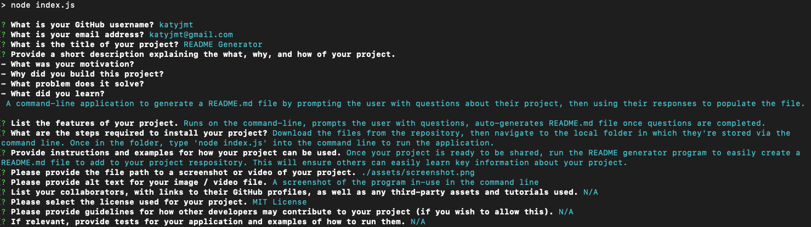

# README Generator

## Badges

## Description
A command-line application to generate a README.md file. The application prompts the user with questions about their project, then uses their responses to populate the file. 

## Table of Contents
- [Video Walkthrough](#video-walkthrough)
- [Features](#features)
- [Installation](#installation)
- [Usage](#usage)
- [License](#license)
- [Contributing](#contributing)
- [Tests](#tests)
- [Credits](#credits)
- [Questions](#questions)

## Video Walkthrough {#video-walkthrough}
[Video Link](https://drive.google.com/file/d/1wa0p8udWO7QJkcUsbczxyMGMxT7vX_02/view)

## Features
Runs on the command-line, prompts the user with questions, auto-generates README.md file once questions are completed.

## Installation
Download the files from the repository, then navigate via the command line to the local folder in which they're stored. Once in the folder, type 'npm i' to install the packages needed for the application, then type 'node index.js' to run the application.

NOTE: This application requires node.js and npm to be installed on the user's computer as a prerequisite for use.

## Usage
Once your project is ready to be shared, run the application to easily create a README.md file within the folder you are in. Then move the file to your project respository to ensure others can easily learn key information about your project.

### Application Screenshot:

## License
All assets and code are under MIT License unless specified otherwise.

## Contributing
N/A

## Tests
N/A

## Credits
N/A

## Questions
Any questions? Visit my GitHub profile at [https://github.com/katyjmt](https://github.com/katyjmt) or email me at [katyjmt@gmail.com](katyjmt@gmail.com).